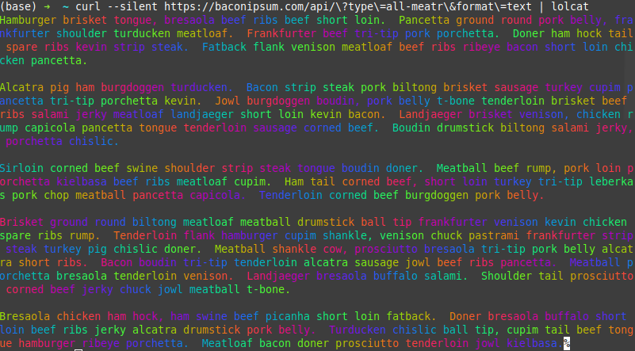

# lolcat

This is my lolcat implementation in Golang

## Install

```
go install github.com/vccolombo/lolcat 
```

## Usage

### With files

```
$ lolcat /path/to/file1 /path/to/file2 ...
```

### With pipes

```
curl example.com | lolcat
```

## Example

